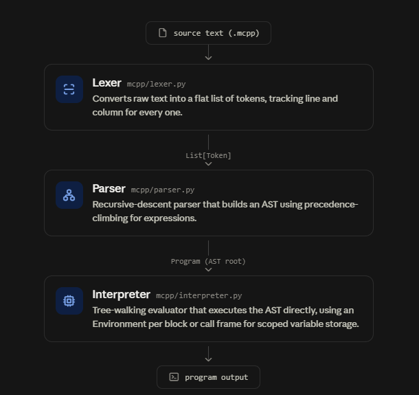

# Mcpp — a C++-like language compiler, built in Python
`mcpp` is a small compiler/interpreter for a C++-flavoured teaching
language, built from scratch in pure Python: a hand-written lexer, a
recursive-descent parser, an AST, and a tree-walking interpreter — no
parser generators, no external compiler libraries.
 
It was built as a university compiler-construction course project, and
is organised the way a small production compiler would be: one module
per pipeline stage, a real test suite, and clear docs — rather than as
a single monolithic script.
 
> **Status:** This is a course project, not a production compiler.
> The pipeline and test suite are solid, but as with any project built
> under coursework deadlines, edge cases can still surface bugs —
> especially around less-common combinations of features (e.g. nested
> `switch` inside loops, or arrays interacting with recursion). Issues
> and pull requests are welcome, and the codebase is small and modular
> enough to fork and take in your own direction — see
> [Extending the project](#extending-the-project) for natural next
> steps.
 

```c
int factorial(int n) {
    if (n <= 1) {
        return 1;
    }
    return n * factorial(n - 1);
}

int main() {
    print("5! = ", factorial(5));
    return 0;
}
```

```
$ python -m mcpp.cli examples/02_functions.mcpp
add(4, 7)     = 11
factorial(6)  = 720
fibonacci(0) = 0
...
```

## Features

- **Complete compilation pipeline**, each stage in its own module:
  tokenizer → recursive-descent parser → AST → tree-walking interpreter
- **C++-style syntax**: typed variables, arithmetic, `if`/`else if`/`else`,
  `while`, `do-while`, `for`, `switch`/`case`, fixed-size arrays,
  functions (including recursion), `break`/`continue`/`return`
- **Position-aware error messages** for lexical, syntax, and runtime
  errors — file:line:column plus a `^` pointer at the offending code,
  the same shape of message a real C/C++ compiler gives
- **40+ automated tests** (`pytest`) covering the lexer, parser, and
  interpreter
- **CLI** to run a program and optionally dump its token stream or AST
- **Browser playground** (Flask) to write and run mcpp code with a
  live output/tokens/AST view
- **Pure standard library** for the compiler core — `flask` and
  `pytest` are only needed for the web UI and the test suite,
  respectively

## Project structure

```
mcpp-compiler/
├── mcpp/                   # the compiler itself
│   ├── tokens.py            #   TokenType enum + Token dataclass
│   ├── lexer.py              #   source text -> tokens
│   ├── ast_nodes.py           #   AST node dataclasses
│   ├── parser.py               #   tokens -> AST (recursive descent)
│   ├── environment.py           #   scoped variable storage
│   ├── interpreter.py            #   AST -> program output
│   ├── errors.py                  #   shared, position-aware error types
│   └── cli.py                      #   command-line entry point
├── web/                    # optional browser playground
│   ├── app.py                #   Flask backend
│   ├── templates/index.html    #   page markup
│   └── static/                  #   CSS + JS
├── examples/                # runnable sample programs
├── tests/                   # pytest test suite
├── docs/
│   ├── LANGUAGE_REFERENCE.md  # full language spec with examples
│   └── ARCHITECTURE.md         # how the pipeline fits together
├── requirements.txt
├── setup.py
└── README.md
```

## Quick start

```bash
# 1. Clone and enter the project
git clone <your-repo-url>
cd mcpp-compiler

# 2. (Optional) create a virtual environment
python -m venv .venv
source .venv/bin/activate        # Windows: .venv\Scripts\activate

# 3. Run a program — the core compiler has zero dependencies
python -m mcpp.cli examples/01_hello.mcpp

# See the token stream or AST alongside the output
python -m mcpp.cli examples/01_hello.mcpp --tokens
python -m mcpp.cli examples/01_hello.mcpp --ast
```

### Browser playground

```bash
pip install -r requirements.txt
python web/app.py
# then open http://127.0.0.1:5000
```

Write mcpp code in the left pane, run it with the button (or
Ctrl/Cmd + Enter), and inspect the output, token stream, or AST in the
right pane.

### Running the tests

```bash
pip install -r requirements.txt
pytest tests/ -v
```

## Language at a glance

## mcpp Language Reference

`mcpp` is a small, C++-flavoured language designed for learning how a
compiler pipeline works. Every program is a set of functions; execution
starts at `main()`.

## 1. Types

| Type     | Example              | Default value |
|----------|-----------------------|--------------|
| `int`    | `int a = 5;`           | `0`          |
| `float`  | `float f = 3.14;`      | `0.0`        |
| `char`   | `char c = 'x';`        | `'\0'`       |
| `string` | `string s = "hello";`  | `""`         |
| `bool`   | `bool flag = true;`    | `false`      |
| `void`   | function return type only | — |

Variables must be declared with a type before use, and only once per
scope.

## 2. Arrays

Arrays are fixed-size and declared with an integer literal size:

```c
int arr[3];
arr[0] = 10;
print(arr[0]);
```

Indexing starts at `0`. Reading or writing outside `[0, size)` is a
runtime error. Arrays are not passed to functions in this version of
the language — keep them global or local to the function that uses
them.

## 3. Operators

| Category    | Operators |
|-------------|-----------|
| Arithmetic  | `+  -  *  /  %` |
| Unary       | `-` (negate), `!` (logical not), `++`, `--` (prefix and postfix) |
| Comparison  | `==  !=  <  <=  >  >=` |
| Logical     | `&&  \|\|` (short-circuit) |
| Assignment  | `=` |

Integer division truncates toward zero, like C++. Dividing by zero
(integer or float) is a runtime error. `%` requires integer operands.

## 4. Conditionals

```c
if (a > b) {
    // ...
} else if (a == b) {
    // ...
} else {
    // ...
}
```

`else if` chains are fully supported.

## 5. Loops

```c
while (condition) { ... }

do { ... } while (condition);   // body runs at least once

for (int i = 0; i < 5; i = i + 1) { ... }
```

`break` exits the nearest loop or `switch`; `continue` skips to the
next iteration of the nearest loop.

## 6. Functions

```c
int add(int x, int y) {
    return x + y;
}

void greet() {
    print("hello");
}
```

- A return type is required: one of `int`, `float`, `char`, `string`,
  `bool`, or `void`.
- Every parameter needs an explicit type.
- Non-`void` functions must return a value on every path that can be
  reached; `void` functions must not return a value.
- Functions may call themselves or each other (recursion is supported).
- Functions must be declared before they can be *parsed as part of a
  program*, but forward calls between two functions both defined in the
  file work fine, since the whole program is parsed before anything runs.

## 7. `print`

```c
print(expression, expression, ...);
```

`print` accepts one or more comma-separated expressions and writes
them to the output with no automatic separators — similar to chaining
`std::cout <<` in C++. Add spaces inside your string literals where
you want them:

```c
print("Sum = ", a + b);   // "Sum = 15"
```

Booleans print as `1` / `0`.

## 8. `switch` / `case`

```c
switch (option) {
    case 1:
        print("one");
        break;
    case 2:
        print("two");
        break;
    default:
        print("other");
}
```

Cases fall through if you omit `break`, exactly like C++.

## 9. Comments

```c
// a single-line comment
/* a
   multi-line comment */
```

## 10. A complete example

```c
int add(int x, int y) {
    return x + y;
}

int main() {
    int a = 5;
    int b = 10;
    bool flag = true;
    int arr[3];
    arr[0] = 1;
    arr[1] = 2;
    arr[2] = 3;

    int sum = add(a, b);
    print("sum = ", sum);

    if (a < b) {
        print("a is less than b");
    } else {
        print("a is greater or equal to b");
    }

    print(flag && (a < b));
    print(flag || (a > b));

    return sum;
}
```

See the `examples/` folder for more runnable programs.


| Feature | Example |
|---|---|
| Types | `int`, `float`, `char`, `string`, `bool` |
| Arrays | `int arr[3]; arr[0] = 10;` |
| Conditionals | `if (a > b) { ... } else if (a == b) { ... } else { ... }` |
| Loops | `while`, `do { } while`, `for (int i = 0; i < n; i++)` |
| Functions | `int add(int x, int y) { return x + y; }` (recursion supported) |
| Switch | `switch (x) { case 1: ...; break; default: ...; }` |
| Printing | `print("sum = ", a + b);` |

## How it works

`mcpp` follows the classic front-end compiler pipeline, with each stage
implemented in its own module so it can be read, tested, and explained
independently.



## Why a tree-walking interpreter instead of "real" codegen?

The project's goal is to demonstrate the *front end* of a compiler
(lexing, parsing, AST construction) clearly. Rather than emitting
another language's source (which just moves the interesting work into
a second language's runtime) or bytecode, the interpreter executes the
AST directly. This keeps every stage inspectable in Python and makes
it straightforward to extend the pipeline later with a real
code-generation backend (e.g. emitting C, LLVM IR, or Python bytecode)
without having to touch the lexer or parser.

## Module map

| Module | Responsibility |
|--------|-----------------|
| `mcpp/tokens.py` | `TokenType` enum and the `Token` dataclass |
| `mcpp/lexer.py` | Source text → tokens |
| `mcpp/ast_nodes.py` | Dataclasses for every AST node |
| `mcpp/parser.py` | Tokens → AST (recursive descent, see the grammar in the module docstring) |
| `mcpp/environment.py` | Scoped variable storage (`Environment` is a linked chain of scopes) |
| `mcpp/interpreter.py` | AST → program output; one `_exec_*`/`_eval_*` method per node type |
| `mcpp/errors.py` | Shared, position-aware error types for every stage |
| `mcpp/cli.py` | Command-line entry point (`python -m mcpp.cli file.mcpp`) |
| `web/app.py` | Optional Flask front end (browser playground) |

## Error handling philosophy

Every stage raises a subclass of `MCPPError` (`LexError`, `ParseError`,
`MCPPRuntimeError`) carrying a line, column, and the offending source
line, so a single `except MCPPError` in the CLI or the web API can
report any failure with a `file:line:col` style message and a `^`
pointer — the same shape of message a real C/C++ compiler gives.

## Control flow without a bytecode VM

`break`, `continue`, and `return` are implemented as Python exceptions
(`BreakSignal`, `ContinueSignal`, `ReturnSignal`) that unwind the
interpreter's own call stack up to the nearest loop or function call.
This keeps the interpreter's structure a direct mirror of the AST's
structure, rather than needing an explicit instruction pointer.

## Extending the project

Natural follow-ups for a course project or portfolio piece:

- **Static type checking** — walk the AST once before interpreting it
  to catch type errors (`int a = "hi";`) ahead of time. `mcpp/errors.py`
  already has a `SemanticError` type ready for this.
- **Arrays as function parameters** — currently arrays must be global
  or local to the function using them; passing them by reference is a
  natural extension of `environment.py`.
- **A real codegen backend** — walk the same AST and emit C or LLVM IR
  instead of interpreting it directly.


## Possible next steps

- A static type checker that runs between parsing and interpreting
- `else if` already supported; adding `elif`-free ternary `?:`
- Passing arrays to functions by reference
- A bytecode compiler + VM as an alternative backend to the
  tree-walking interpreter

